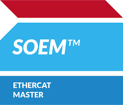

# SOEM Middleware

## Introduction to Simple Open EtherCAT Master Library

SOEM (Simple Open EtherCAT Master) is an open source EtherCAT master stack which is very easy to use and provides a small footprint. It is a good alternative to more complex stacks on the market and is especially well suited for embedded systems.

SOEM EtherCAT Master Library, written in C, is used to write custom EtherCAT Master applications. Can run on a large number of platforms, the main requirement is that the platform can send and receive RAW Ethernet Layer 2 frames.

## Key features:

- EtherCAT master for cyclic I/O and motion devices
- Lightweight, portable C code
- Bus scan, topology validation, and SII (slave EEPROM) access
- CoE support (SDO/OD access) and PDO mapping
- Distributed Clocks (DC) synchronization for precise cycle timing
- Simple API for state transitions and process data exchange
- Reference examples and diagnostics utilities

## SOEM for Modus Toolbox

This library package is an adaptation of SOEM for Modus Toolbox and the XMC72_EVK platform.

- [SOEM User Example](https://github.com/rtlabs-com/mtb-example-soem) - SOEM MTB Example Application on GitHub
- [SOEM Middleware](https://github.com/rtlabs-com/mtb-mw-uphy) - U-Phy MTB Middleware on GitHub
- [SOEM](https://rt-labs.com/product/soem/) - General introduction to the SOEM concept and features

Also see https://github.com/OpenEtherCATsociety/SOEM

### Time limitation

 Runtime of SOEM library is limited to 2 hours. To obtain the full version, please contact your regional sales representative of Infineon Technologies AG. 

 If modifying the library or replacing it with public code GPLv3 takes precendence. See [LICENSE](./LICENSE)

### Documentation

https://docs.rt-labs.com/soem/ (user account & login required)

### License

[LICENSE](./LICENSE)

